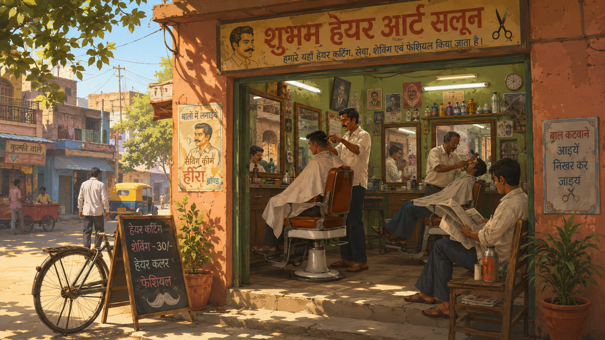
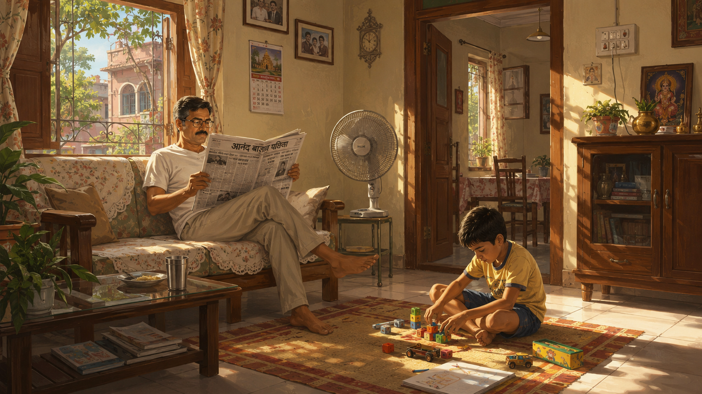
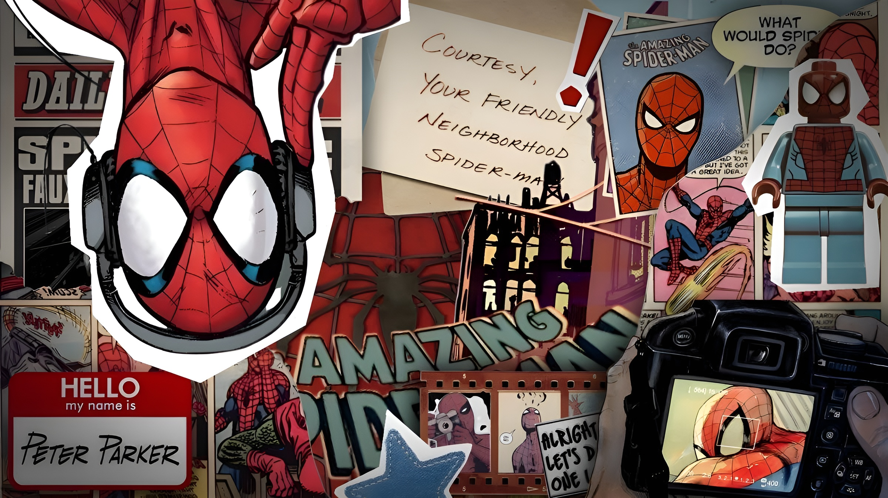
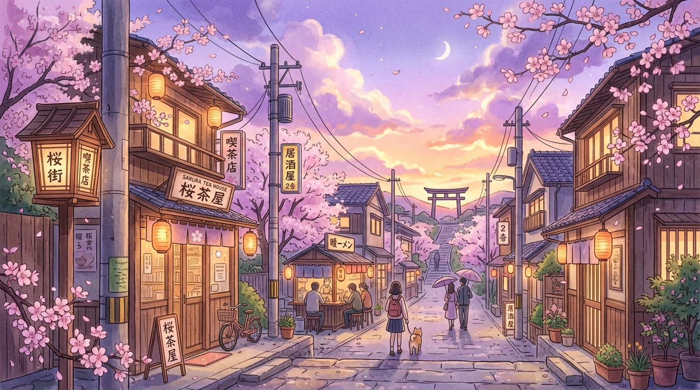

<div align="center">

# ✨ Nostalgic Site Builder
**Create your own viral, nostalgic ambient playlist web apps — in seconds, with zero code.**

[](https://nostalgic-site-builder.vercel.app/)

<br />

[](https://nextjs.org/)
[](https://www.typescriptlang.org/)
[](https://react.dev/)
[](https://opensource.org/licenses/MIT)

<br /><br />


</div>

---

## 🌐 Live Web App

Try the builder instantly without installing anything:  
👉 **[nostalgic-site-builder.vercel.app](https://nostalgic-site-builder.vercel.app/)**

---

## 💭 Why this exists

You've probably seen those viral single-page ambient music websites (like [saloon.wtf](https://saloon.wtf)) — aesthetic retro artwork, bold two-line typography, a ticking live clock, and a frosted vinyl player streaming cozy YouTube playlists in the background.

People often spend hours prompt-engineering and **burning through expensive Claude / LLM tokens** trying to research the architecture, bypass YouTube IFrame API restrictions, write JSZip bundling logic, and fix CSS glassmorphism stacking contexts.

**This builder automates everything.** In just 3 clicks on the web, you can customize your theme, attach any YouTube playlist, pick or upload an image/GIF, test it in live preview, and download a ready-to-run, standalone **Next.js App Router** project.

---

## ⚡ How to Build & Deploy Your Own Nostalgic Site

### 1. Open the Builder
Head over to **[nostalgic-site-builder.vercel.app](https://nostalgic-site-builder.vercel.app/)**.

### 2. Customize in 3 Steps
1. **Name your site**: Enter your site's title (press `Enter` to split into two lines for that retro look, e.g. `Deluxe \n Saloon`).
2. **Attach a YouTube Playlist**: Paste any public YouTube playlist URL. No API keys required.
3. **Pick a Background**: Choose from our pre-made nostalgia art library or upload your own high-res **JPG**, **PNG**, **WebP**, or animated **GIF**.

### 3. Download & Run
Click **Download ZIP**. You'll get a fully-configured, standalone **Next.js 15 + TypeScript** project.

Unzip the folder, open it in your terminal, and run:

```bash
npm install
npm run dev
```

Open [http://localhost:3000](http://localhost:3000) to enjoy your personal ambient site!

### 4. Deploy Anywhere
Your exported project is 100% production-ready. You can push it to GitHub and deploy it directly to **[Vercel](https://vercel.com/)** or **[Netlify](https://www.netlify.com/)** with zero additional configuration.

---

## ✨ Features

- 🎵 **Zero-Cost Music Streaming**: Streams music via YouTube IFrame API — no API tokens or billing needed.
- 🖼️ **Full Media & GIF Support**: Upload custom images or animated GIFs up to 15MB, or pick from the built-in library.
- 🔤 **Large Two-Line Retro Typography**: Multi-line typography with deep drop shadows matching classic nostalgic album & shop signs.
- 🕒 **Live Ambient Clock**: Real-time 12-hour digital clock in the top-left corner.
- 💿 **Frosted Glass Vinyl Player**: Interactive turntable spinning vinyl cover art fetched live from video thumbnails, full seekbar, track info, and playback controls.
- ⌨️ **Keyboard Controls**: Press `Space` to play/pause, `Arrow Right` for next track, and `Arrow Left` to rewind/skip back.
- 📦 **Standalone Next.js Export**: Clean Next.js 15 App Router + TypeScript codebase packaged entirely on the client side.

---

## 🖼️ Pre-made Art Library

The builder comes bundled with aesthetic vintage & nostalgia-themed art:

| Salon Classic | Durga Puja | Nostalgic Childhood |
|:---:|:---:|:---:|
|  |  |  |

| Truck Art | Spidey Vintage | Sakura Twilight |
|:---:|:---:|:---:|
|  |  |  |

---

## 🛠️ Running the Builder Locally (Contributing / Self-Hosting)

If you'd like to run or modify the **Nostalgic Site Builder** itself locally on your machine:

```bash
# 1. Clone the repository
git clone https://github.com/deepdhar/aesthetic-web-builder.git
cd aesthetic-web-builder

# 2. Install dependencies
npm install

# 3. Start the development server
npm run dev
```

Open [http://localhost:3000](http://localhost:3000) in your browser.

---

## 📄 License

MIT License. Feel free to build, remix, and share your nostalgic creations!


